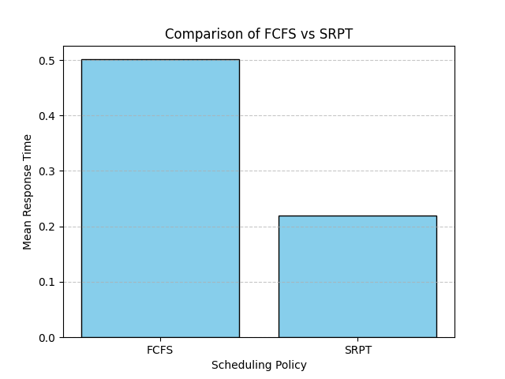

# queue-sim

A discrete-event simulation engine for queueing networks, with a C++ hot-path backend exposed to Python via pybind11.

Supports pluggable scheduling policies (FCFS, SRPT, PS, FB), multi-server queues (G/G/k), tandem and feedback networks with probabilistic routing, and statistically rigorous output analysis via independent replications with confidence intervals.

## Architecture

```
queue_sim/          Python frontend — system construction, replication logic, statistics
csrc/               C++ backend — event loop, servers, distributions (pybind11)
tests/              118 tests — analytical validation, Little's law, property-based (Hypothesis)
```

**Dual backend.** The same `QueueSystem` interface is available in pure Python and as a compiled C++ extension. The C++ event loop releases the GIL during simulation, enabling concurrent execution.

**Server abstraction.** Scheduling policies inherit from an abstract `Server` base class and implement arrival/completion logic independently. Current policies:
- **FCFS** — first-come first-served (supports `num_servers` for G/G/k)
- **SRPT** — shortest remaining processing time (preemptive)
- **PS** — processor sharing (supports `num_servers` for G/G/k — all jobs share k servers)
- **FB** — foreground-background / least attained service (serves jobs with least accumulated service)

**Multi-server queues (G/G/k).** FCFS and PS accept a `num_servers` parameter. With k servers, FCFS runs up to k jobs in parallel (rest wait in FIFO queue); PS shares k servers among all n jobs (rate min(k,n)/n per job). Validated against the Erlang-C formula for M/M/k.

**Statistical output.** `replicate()` runs N independent replications with deterministic per-replication seeds (SplitMix64), optional warmup, and returns t-distribution confidence intervals — no scipy dependency.

## Installation

```bash
pip install "git+https://github.com/Ak33ra/queue-sim.git"
```

For development (editable install, compiles C++ extension):

```bash
git clone https://github.com/Ak33ra/queue-sim.git
cd queue-sim
pip install -e ".[dev]"
```

Requires a C++17 compiler and Python >= 3.9.

## Usage

Both backends expose the same `QueueSystem` interface with a few differences:

| | Python | C++ |
|---|---|---|
| **Distributions** | Any `Callable[[], float]` — custom distributions, mixtures, etc. | Three built-in types only (`ExponentialDist`, `UniformDist`, `BoundedParetoDist`) |
| **Multi-server (G/G/k)** | `num_servers` param on FCFS, PS | `num_servers` param on FCFS, PS |
| **Parallel replications** | Sequential only | `n_threads` parameter for multithreaded execution |
| **GIL** | Held during simulation | Released — won't block other Python threads |

### Python Backend

```python
from queue_sim import QueueSystem, FCFS, SRPT, PS, FB, genExp, genUniform

# --- Scheduling policies ---

# M/M/1-FCFS: Poisson arrivals (rate 1), exponential service (rate 2)
system = QueueSystem([FCFS(sizefn=genExp(2.0))], arrivalfn=genExp(1.0))
N, T = system.sim(num_events=10**6, seed=42)
# E[T] = 1/(mu - lam) = 1.0

# M/M/1-SRPT: preempts current job when a shorter one arrives
system = QueueSystem([SRPT(sizefn=genExp(2.0))], arrivalfn=genExp(1.0))
N, T = system.sim(num_events=10**6, seed=42)

# M/G/1-PS: all jobs share the server equally (rate 1/n each)
system = QueueSystem([PS(sizefn=genUniform(0.3, 0.7))], arrivalfn=genExp(1.0))
N, T = system.sim(num_events=10**6, seed=42)
# E[T] = E[S] / (1 - rho) for any service distribution

# M/M/1-FB: always serves job(s) with least attained service
system = QueueSystem([FB(sizefn=genExp(2.0))], arrivalfn=genExp(1.0))
N, T = system.sim(num_events=10**6, seed=42)

# --- Multi-server (G/G/k) ---

# M/M/2-FCFS: 2 parallel servers, each with rate 1
system = QueueSystem([FCFS(sizefn=genExp(1.0), num_servers=2)], arrivalfn=genExp(1.0))
N, T = system.sim(num_events=10**6, seed=42)
# E[T] = 4/3 (Erlang-C formula)

# M/M/2-PS: 2 servers shared among all jobs
system = QueueSystem([PS(sizefn=genExp(1.0), num_servers=2)], arrivalfn=genExp(1.0))
N, T = system.sim(num_events=10**6, seed=42)

# --- Networks ---

# Tandem: FCFS -> SRPT (jobs flow through in series)
system = QueueSystem(
    [FCFS(sizefn=genExp(4.0)), SRPT(sizefn=genExp(4.0))],
    arrivalfn=genExp(1.0),
)
N, T = system.sim(num_events=10**6, seed=42)

# Feedback: 30% of jobs return to server 0 after completion
system = QueueSystem([PS(sizefn=genExp(2.0))], arrivalfn=genExp(1.0))
system.updateTransitionMatrix([[0.3, 0.7]])  # [to server 0, exit]
N, T = system.sim(num_events=10**6, seed=42)

# --- Replications with confidence intervals ---

system = QueueSystem([FCFS(sizefn=genExp(2.0))], arrivalfn=genExp(1.0))
result = system.replicate(
    n_replications=30, num_events=10**6, seed=42, warmup=10_000,
)
print(f"E[T] = {result.mean_T:.4f}  95% CI: {result.ci_T}")
```

### C++ Backend

The C++ backend uses the same API but with distribution objects instead of callables. Simulations release the GIL, and `replicate()` supports parallel execution via `n_threads`.

```python
import _queue_sim_cpp as cpp

# --- Scheduling policies ---

# M/M/1-FCFS
system = cpp.QueueSystem([cpp.FCFS(cpp.ExponentialDist(2.0))], cpp.ExponentialDist(1.0))
N, T = system.sim(num_events=10**6, seed=42)

# M/G/1-PS with uniform service
system = cpp.QueueSystem([cpp.PS(cpp.UniformDist(0.3, 0.7))], cpp.ExponentialDist(1.0))
N, T = system.sim(num_events=10**6, seed=42)

# M/M/1-FB
system = cpp.QueueSystem([cpp.FB(cpp.ExponentialDist(2.0))], cpp.ExponentialDist(1.0))
N, T = system.sim(num_events=10**6, seed=42)

# --- Multi-server (G/G/k) ---

# M/M/2-FCFS
system = cpp.QueueSystem(
    [cpp.FCFS(cpp.ExponentialDist(1.0), num_servers=2)], cpp.ExponentialDist(1.0)
)
N, T = system.sim(num_events=10**6, seed=42)

# M/M/2-PS
system = cpp.QueueSystem(
    [cpp.PS(cpp.ExponentialDist(1.0), num_servers=2)], cpp.ExponentialDist(1.0)
)
N, T = system.sim(num_events=10**6, seed=42)

# --- Networks ---

# Tandem: PS -> FCFS
system = cpp.QueueSystem(
    [cpp.PS(cpp.ExponentialDist(4.0)), cpp.FCFS(cpp.ExponentialDist(4.0))],
    cpp.ExponentialDist(1.0),
)
N, T = system.sim(num_events=10**6, seed=42)

# --- Parallel replications ---

system = cpp.QueueSystem([cpp.FCFS(cpp.ExponentialDist(2.0))], cpp.ExponentialDist(1.0))
raw = system.replicate(
    n_replications=30, num_events=10**6, seed=42, warmup=10_000, n_threads=4,
)
# raw.raw_T and raw.raw_N are lists of per-replication results

# Wrap with CI computation (no scipy needed)
from queue_sim.results import _build_replication_result
result = _build_replication_result(tuple(raw.raw_N), tuple(raw.raw_T), 0.95)
print(f"E[T] = {result.mean_T:.4f}  95% CI: {result.ci_T}")
```

### Available Distributions

| Python | C++ | Parameters |
|---|---|---|
| `genExp(mu)` | `ExponentialDist(mu)` | rate `mu`, E[X] = 1/mu |
| `genUniform(a, b)` | `UniformDist(a, b)` | support [a, b] |
| `genBoundedPareto(k, p, alpha)` | `BoundedParetoDist(k, p, alpha)` | shape `alpha`, range [k, p] |

## Testing and Validation

```bash
pytest tests/ -v
```

Tests validate simulation output against closed-form results:

- **Analytical (M/M/1):** E[T] = 1/(mu - lambda), E[N] = rho/(1 - rho), verified for FCFS, PS, and FB within 5% tolerance
- **Analytical (M/G/1):** Pollaczek-Khinchine formula for FCFS, E[S]/(1-rho) for PS, with Uniform service
- **Analytical (M/M/k):** Erlang-C formula for FCFS and PS with k=2 servers, verified on both backends
- **Little's Law:** E[N] = lambda * E[T] verified for both FCFS and SRPT
- **Confidence intervals:** 95% CI from `replicate()` covers the true E[T] on both Python and C++ backends
- **Property-based (Hypothesis):** fuzz tests for edge cases and invariant checking
- **Seed determinism:** identical seeds produce identical results; verified on both backends

## Example: Scheduling Policy Comparison

See `example_schedule_comparison.py` for a full worked example comparing FCFS vs SRPT under varying load.

At low load the policies perform similarly, but as utilization approaches 1, SRPT significantly outperforms FCFS in mean response time:

| | FCFS vs SRPT (rho -> 1) |
|---|---|
|  |  |

## Project Structure

```
queue_sim/
  __init__.py             Public API and exports
  queueSystem.py          QueueSystem — sim() and replicate()
  results.py              ReplicationResult, CI computation, seed derivation
  server.py               Abstract Server base class
  policies/
    FCFS.py               First-come first-served
    SRPT.py               Shortest remaining processing time
    PS.py                 Processor sharing
    FB.py                 Foreground-background (least attained service)
  lib/
    rvGen.py              Distribution samplers (Exp, Uniform, BoundedPareto)

csrc/
  include/queue_sim/      C++ headers (distributions, server, FCFS, SRPT, PS, FB, queue_system)
  src/bindings.cpp        pybind11 module definition

tests/                    pytest suite (analytical, M/M/k, Little's law, replications, C++ backend)
benchmarks/               Performance benchmarks
```

## License

MIT
