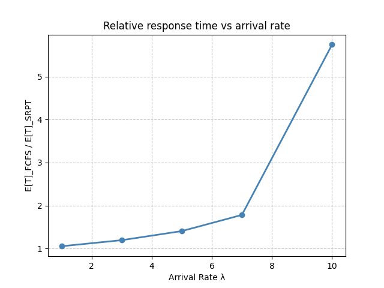

# queue-sim

A discrete-event simulation engine for queueing networks, with a C++ hot-path backend exposed to Python via pybind11.

Supports pluggable scheduling policies (FCFS, SRPT, PS, FB), multi-server tandem and feedback networks with probabilistic routing, and statistically rigorous output analysis via independent replications with confidence intervals.

## Architecture

```
queue_sim/          Python frontend — system construction, replication logic, statistics
csrc/               C++ backend — event loop, servers, distributions (pybind11)
tests/              99 tests — analytical validation, Little's law, property-based (Hypothesis)
```

**Dual backend.** The same `QueueSystem` interface is available in pure Python and as a compiled C++ extension. The C++ event loop releases the GIL during simulation, enabling concurrent execution.

**Server abstraction.** Scheduling policies inherit from an abstract `Server` base class and implement arrival/completion logic independently. Current policies:
- **FCFS** — first-come first-served
- **SRPT** — shortest remaining processing time (preemptive)
- **PS** — processor sharing (all jobs share capacity equally)
- **FB** — foreground-background / least attained service (serves jobs with least accumulated service)

**Statistical output.** `replicate()` runs N independent replications with deterministic per-replication seeds (SplitMix64), optional warmup, and returns t-distribution confidence intervals — no scipy dependency.

## Installation

```bash
pip install "git+https://github.com/Ak33ra/queue-sim.git"
```

For development (editable install, compiles C++ extension):

```bash
git clone https://github.com/Ak33ra/queue-sim.git
cd queue-sim
pip install -e ".[dev]"
```

Requires a C++17 compiler and Python >= 3.9.

## Quick Start

```python
from queue_sim import QueueSystem, FCFS, SRPT, PS, FB, genExp

# M/M/1: Poisson arrivals (rate 1), exponential service (rate 2)
system = QueueSystem([FCFS(sizefn=genExp(2.0))], arrivalfn=genExp(1.0))

# Single run — returns (E[N], E[T])
N, T = system.sim(num_events=10**6, seed=42)

# Multiple replications — returns ReplicationResult with CIs
result = system.replicate(n_replications=30, num_events=10**6, seed=42)
print(f"E[T] = {result.mean_T:.4f}  95% CI: [{result.ci_T[0]:.4f}, {result.ci_T[1]:.4f}]")
```

### Processor Sharing

```python
# M/G/1-PS: all jobs share the server equally
from queue_sim import genUniform

system = QueueSystem([PS(sizefn=genUniform(0.3, 0.7))], arrivalfn=genExp(1.0))
result = system.replicate(n_replications=30, num_events=10**6, seed=42)
# E[T] = E[S] / (1 - rho) for any service distribution
```

### Tandem Network

```python
# Two servers in series: FCFS -> SRPT
fifo = FCFS(sizefn=genExp(2.0))
srpt = SRPT(sizefn=genExp(2.0))
system = QueueSystem([fifo, srpt], arrivalfn=genExp(1.0))
N, T = system.sim(num_events=10**6, seed=42)
```

### Probabilistic Routing

```python
# Feedback network: 30% of jobs return to server 0 after completion
system = QueueSystem([FCFS(sizefn=genExp(2.0))], arrivalfn=genExp(1.0))
#                     to server 0  |  exit
system.updateTransitionMatrix([[0.3,         0.7]])
N, T = system.sim(num_events=10**6, seed=42)
```

## Testing and Validation

```bash
pytest tests/ -v
```

Tests validate simulation output against closed-form results:

- **Analytical (M/M/1):** E[T] = 1/(mu - lambda), E[N] = rho/(1 - rho), verified for FCFS, PS, and FB within 5% tolerance
- **Analytical (M/G/1):** Pollaczek-Khinchine formula for FCFS, E[S]/(1-rho) for PS, with Uniform service
- **Little's Law:** E[N] = lambda * E[T] verified for both FCFS and SRPT
- **Confidence intervals:** 95% CI from `replicate()` covers the true E[T] on both Python and C++ backends
- **Property-based (Hypothesis):** fuzz tests for edge cases and invariant checking
- **Seed determinism:** identical seeds produce identical results; verified on both backends

## Example: Scheduling Policy Comparison

See `example_schedule_comparison.py` for a full worked example comparing FCFS vs SRPT under varying load.

At low load the policies perform similarly, but as utilization approaches 1, SRPT significantly outperforms FCFS in mean response time:

| | FCFS vs SRPT (rho -> 1) |
|---|---|
|  |  |

## Project Structure

```
queue_sim/
  __init__.py             Public API and exports
  queueSystem.py          QueueSystem — sim() and replicate()
  results.py              ReplicationResult, CI computation, seed derivation
  server.py               Abstract Server base class
  policies/
    FCFS.py               First-come first-served
    SRPT.py               Shortest remaining processing time
    PS.py                 Processor sharing
    FB.py                 Foreground-background (least attained service)
  lib/
    rvGen.py              Distribution samplers (Exp, Uniform, BoundedPareto)

csrc/
  include/queue_sim/      C++ headers (distributions, server, FCFS, SRPT, PS, FB, queue_system)
  src/bindings.cpp        pybind11 module definition

tests/                    pytest suite (analytical, Little's law, replications, C++ backend)
benchmarks/               Performance benchmarks
```

## License

MIT
